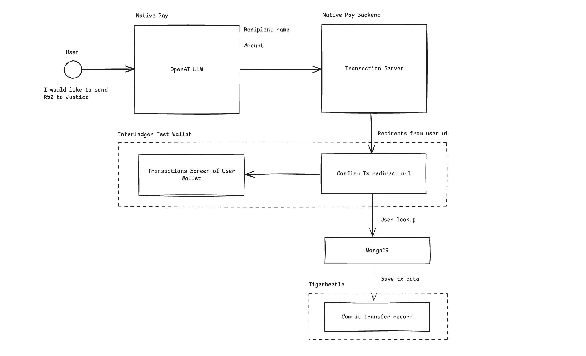

# Native Pay

Native Pay is a payment platform designed to simplify the process of sending money by allowing users to make transactions in their native language. By integrating AI and the Interledger Open Payments API, Native Pay makes payments easy and accessible, especially for users who struggle with language barriers or complex payment systems.

Watch our demo to see Native Pay in action:  
[](https://www.youtube.com/watch?v=D7UL1uHWY-A)

### Problem We Are Solving

Many people around the world face challenges when it comes to using digital payment systems. These challenges are often due to:
- Language barriers: Payment platforms are typically designed with one or a few languages in mind, making it difficult for non-native speakers.
- Complexity: Many payment platforms require users to understand technical terms or follow complicated processes.
- Accessibility: People without technical expertise often find it difficult to make transactions or navigate through financial systems.

Native Pay addresses these issues by allowing users to interact with the system in their own language. The AI translates their instructions into a transaction payload, making the process smooth and intuitive. All the user has to do is confirm the payment.

## Links

* Presentation: [Google slides](https://docs.google.com/presentation/d/1-yY-g48OM9C6VUGOn8OyRgjIrmdTvfojEDjSFLWAG24/edit?usp=sharing)
* Demo Link: [NativePay Live PWA](https://native-pay.vercel.app/)

## How it works

- **Native Language Support:** Users can send payments using natural language input, such as "Send R100 to Blessing."
- **AI-Powered Transactions:** AI processes the user’s input, generating a payment payload and handling the technical details behind the scenes.
- **Interledger Integration:** Leveraging the Open Payments API, Native Pay allows seamless transactions across different payment networks.




## How to run

1. Change directory into native-pay:
   ```bash
   cd native-pay
   ```

2. Update the `.env` file with the OpenAI API key:
   ```bash
   OPENAI_API_KEY = "<API KEY HERE>"
   ```

3. Install dependencies:
   ```bash
   npm i
   ```

4. Run the project:
   ```bash
   npm run dev
   ```

5. Open another terminal and change directory into `native-pay-backend`:
   ```bash
   cd native-pay-backend
   ```

6. Update the `.env` file with your wallet address from [Test Wallet](https://wallet.interledger-test.dev/):
   ```bash
   WALLET_ADDRESS = "<WALLET ADDRESS>"
   ```

7. Install dependencies for the backend:
   ```bash
   npm i
   ```

8. Start the server:
   ```bash
   npm run start
   ```

The backend runs on port 8000 and the front-end runs on port 3000. Ensure you are using the same browser in which you logged into your test wallet.


## Team members

* [Blessing](https://github.com/Blssngx)
* [Justice](https://github.com/JusticeMuch)
* [Maphuti](https://github.com/Maphuti-Shilabje)
* [Prejlin](https://github.com/PrejlinN)

### Benefits
1. **Ease of Use:** Native Pay makes the payment process as simple as speaking or typing in your native language, removing language and technical barriers.
2. **Wider Accessibility:** By supporting multiple languages and simplifying payment processes, the platform can reach more users, especially in underserved communities.
3. **Faster Transactions:** With AI handling the technical aspects of creating transaction payloads, users can complete payments quickly and efficiently.
4. **Security and Transparency:** Users are in control, as they must confirm the transaction details before any payment is made.
5. **Interoperability:** By using the Interledger protocol, Native Pay can facilitate payments across various platforms and currencies, making it a globally adaptable solution.

## Conclusion
Native Pay is designed to bridge the gap between technology and accessibility, making it easier for anyone to send payments without worrying about language or complex financial systems. With AI and Open Payments API at its core, Native Pay offers a user-friendly, secure, and efficient way to handle transactions.
